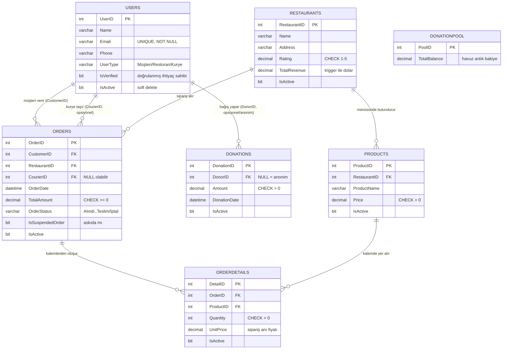

# Varlık-İlişki (ER) Diyagramı

Aşağıdaki diyagram GitHub üzerinde otomatik render edilir (Mermaid `erDiagram`).
Anahtarlar: **PK** = Primary Key, **FK** = Foreign Key.

## İlişkilerin Açıklaması

| İlişki | Tip | Açıklama |
|---|---|---|
| Users → Orders (CustomerID) | 1 : N | Bir müşteri çok sipariş verir. |
| Users → Orders (CourierID) | 1 : N | Bir kurye çok sipariş taşır; sipariş başında NULL olabilir. |
| Users → Donations (DonorID) | 1 : N | Bir müşteri çok bağış yapar; NULL ise anonim. |
| Restaurants → Products | 1 : N | Bir restoranın çok ürünü olur. |
| Restaurants → Orders | 1 : N | Bir restoran çok sipariş alır. |
| Orders → OrderDetails | 1 : N | Bir sipariş çok kalemden oluşur. |
| Products → OrderDetails | 1 : N | Bir ürün çok sipariş kaleminde geçer. |

**Orders ↔ Products arasındaki M:N ilişki**, `OrderDetails` köprü (ara) tablosu
ile çözülmüştür: bir sipariş birden çok ürün, bir ürün birden çok sipariş
içerebilir; bağlantı bilgisi (adet, birim fiyat) köprü tabloda tutulur.

**DonationPool**, fiziksel FK ile bağlı değildir; havuzun anlık bakiyesini tutan
tek satırlık bir özet tablodur. Bağışlar (`Donations`) ile beslenir, askıda
siparişlerle (`Orders.IsSuspendedOrder = 1`) tetikleyici üzerinden düşülür.

> Not: `||--o{` gösterimi "bir tarafta tam (1), çok tarafta sıfır veya daha
> fazla (0..N)" anlamına gelir.
